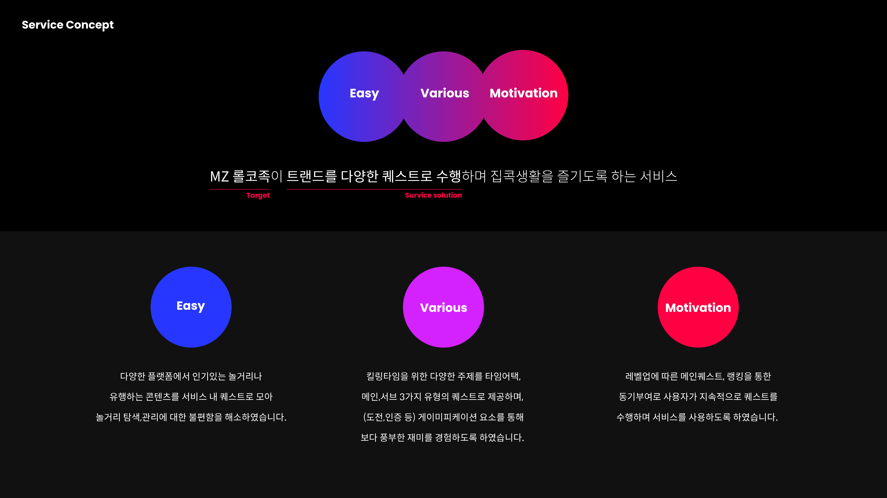

<div align="center" style="display:flex;">
	
</div>


## 1. Trolly란?

🏡 당신의 집콕생활에 즐거움을 더하다. 🧚🏻‍♀️

Play trendy in my room, Trolly


장기전에 돌입한 코로나… 많은 것이 언택트로 진행되고 있습니다.

혼자 놀기는 지루하고 그렇다고 사람을 만날 수는 없는 이 상황, 너무 답답하지 않으신가요? 

길어지는 집콕생활에 즐거움을 더해 줄 서비스 트롤리를 소개합니다. 

트롤리는 **트렌드**와 쉽게 흥미를 가졌다 다시 새로운 놀거리를 찾아 빠르게 이동하는 소비트렌드인 **롤러코스터족**의 합성어입니다.

MZ세대 롤코족의 주류인 대학생들을 위해 저희 서비스는 트렌드를 다양한 퀘스트로 수행하며 다채로운 집콕생활을 즐기도록 돕습니다.


## 2. Features
<div align="center" style="display:flex;">
	
</div>


## 3. Functions
* 메인화면
    - 타임어택 퀘스트
    - 메인 퀘스트
    - 서브 퀘스트
    - (사심 담아) 광고
* 인증 후기
    - 타임어택의 경우 실시간 인증 가능
    - 기타 퀘스트의 경우 상시 확인 가능
* 스탬프
    - 퀘스트를 완료할 때마다 도장이 쾅❗️
    - 도장을 전부 다 모으면 레벨 업✨ 
* 마이페이지
    - 내 정보 조회
    - 나의 레벨 및 소개
    - 나의 랭킹 및 소개 (10위까지 명예의 전당에 오를 수 있어요👀)
    - 히스토리

트롤리의 핵심은 게이미피케이션 요소를 가미한 UI라니깐 얼른 확인하러 가자🙋🏻‍♀️

[시연영상자리,,,]

## 4. Architecture
* cloud server: NCP, AWS-s3
* Back-end: Node.js, express
* Front-end: Mobile-Android


## 5. dependencies
```json
  "dependencies": {
    "aws-sdk": "^2.824.0",
    "body-parser": "^1.19.0",
    "cookie-parser": "~1.4.4",
    "debug": "~2.6.9",
    "express": "^4.16.4",
    "http-errors": "~1.6.3",
    "jade": "~1.11.0",
    "jsonwebtoken": "^8.5.1",
    "moment": "^2.29.1",
    "moment-timezone": "^0.5.32",
    "mongoose": "^5.11.11",
    "morgan": "~1.9.1",
    "multer": "^1.4.2",
    "multer-s3": "^2.9.0",
    "nodemon": "^2.0.7",
  }
```

### [Notion](https://www.notion.so/Jcozy-Gokathon-537a92cea709421a85f74a2281f5df09)

### [API 명세서](https://github.com/koreahacks/2021-jcozy-server/wiki)

### [Android](https://github.com/koreahacks/2021-jcozy-Android)
